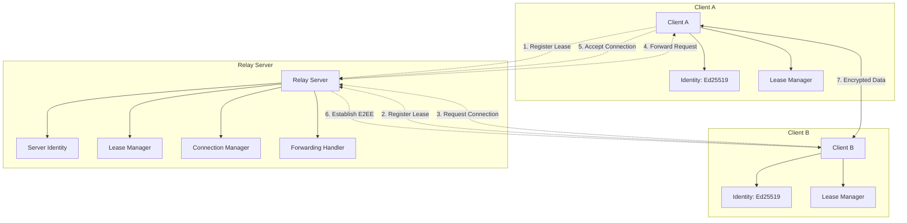
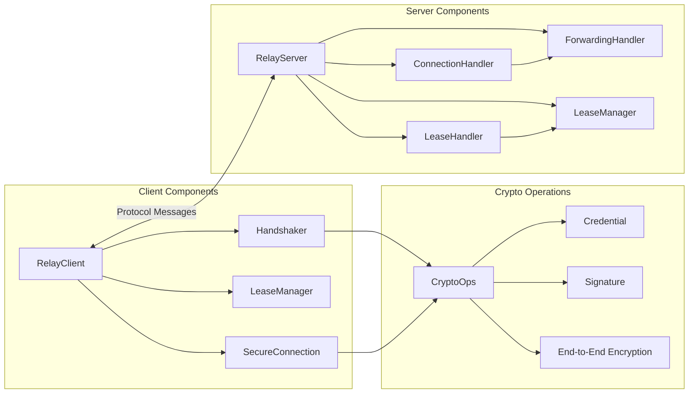
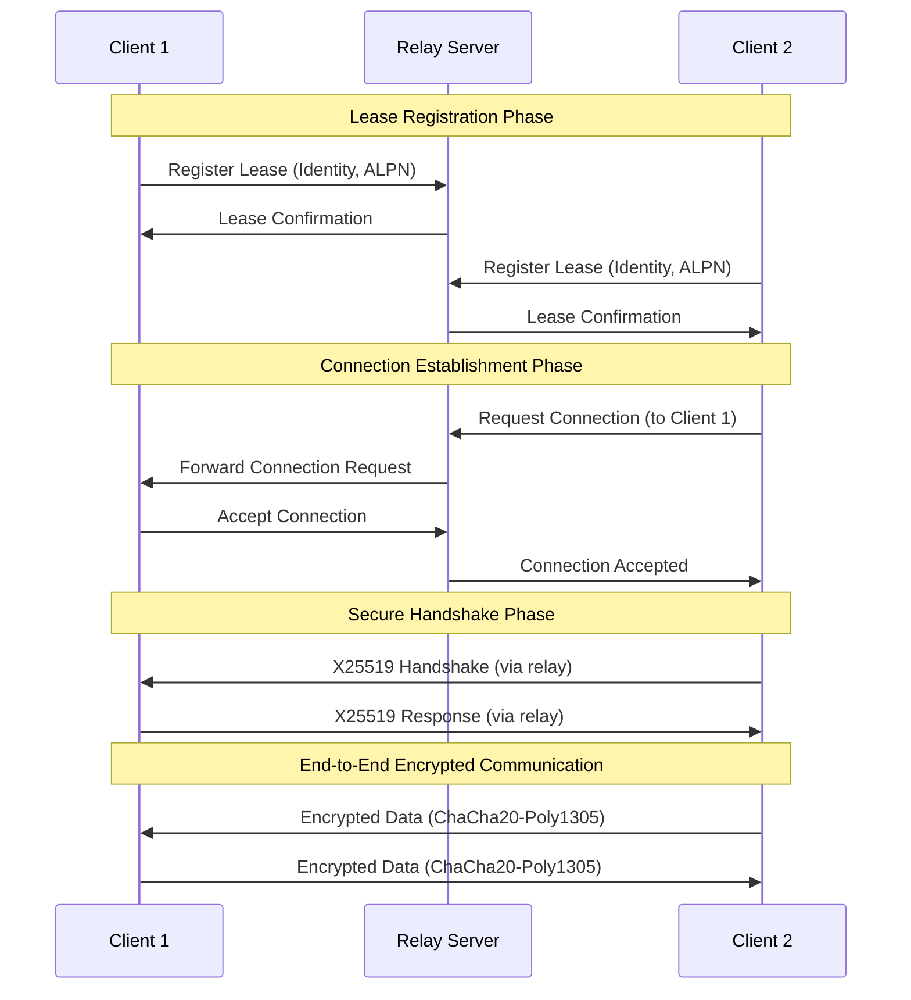
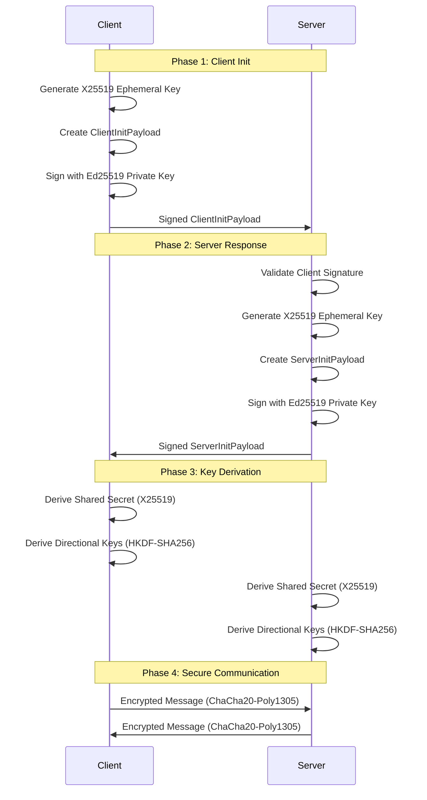

# PORTAL — Public Open Relay To Access Localhost
<p align="center">
  
</p>

Portal is a secure, encrypted relay service that enables end-to-end encrypted communication between clients through a central relay server. It provides mutual authentication, forward secrecy, and secure connection management with cryptographic identity verification.

## Table of Contents

- [Overview](#overview)
- [Features](#features)
- [Architecture](#architecture)
- [Security](#security)
- [Installation](#installation)
- [Usage](#usage)
- [API Reference](#api-reference)
- [Protocol Specification](#protocol-specification)
- [Development](#development)
- [Contributing](#contributing)
- [License](#license)

## Overview

Portal implements a secure relay protocol that allows clients to register leases and establish encrypted connections through a central server. The system uses modern cryptographic primitives to ensure:

- **End-to-end encryption**: All communication is encrypted using ChaCha20-Poly1305 AEAD
- **Mutual authentication**: Ed25519 signatures verify client identities
- **Forward secrecy**: Ephemeral X25519 key exchange per connection
- **Secure relay**: The relay server cannot decrypt client communications

## Features

- 🔐 **End-to-End Encryption**: Client-to-client communication is fully encrypted
- 🔑 **Cryptographic Identity**: Ed25519-based identity system with verifiable signatures
- 🔄 **Connection Relay**: Secure connection forwarding through central server
- ⏰ **Lease Management**: Time-based lease system with automatic cleanup
- 🌐 **Protocol Support**: Application-Layer Protocol Negotiation (ALPN)
- 🚀 **High Performance**: Multiplexed connections using yamux
- 🐳 **Docker Support**: Containerized deployment ready
- 🌍 **Browser E2EE Proxy**: WASM-based Service Worker for automatic browser encryption
- 📱 **Multi-Platform**: Go SDK for servers, WASM SDK for browsers

## Architecture

### System Architecture



### Component Architecture



### Connection Flow



### Cryptographic Handshake Flow



## Security

### Cryptographic Primitives

- **Ed25519**: Digital signatures for identity verification
- **X25519**: Ephemeral key exchange for forward secrecy
- **ChaCha20-Poly1305**: Authenticated encryption for data confidentiality
- **HKDF-SHA256**: Key derivation for session keys
- **HMAC-SHA256**: Identity derivation from public keys

### Security Properties

- **Mutual Authentication**: Both parties verify each other's identities
- **Forward Secrecy**: Compromise of long-term keys doesn't compromise past sessions
- **Replay Protection**: Timestamps and random nonces prevent replay attacks
- **Integrity**: AEAD authentication tags prevent tampering
- **Confidentiality**: End-to-end encryption prevents relay server access

### Threat Mitigation

- **Man-in-the-Middle**: Prevented by Ed25519 signature verification
- **Replay Attacks**: Mitigated by timestamp validation and unique nonces
- **Downgrade Attacks**: Protocol version validation prevents downgrade
- **Denial of Service**: Packet size limits and silent failure on invalid handshakes

## Installation

### Prerequisites

- Go 1.25.3 or later
- Docker (for containerized deployment)

### Build from Source

```bash
# Clone the repository
git clone https://github.com/gosuda/portal.git
cd portal

# Build WASM SDK (includes E2EE Proxy Service Worker)
make build-wasm

# Build relay server (embeds WASM files)
make build-server

# Run relay server
./bin/relayserver
```

### Docker Deployment

```bash
# Build with Docker (multi-stage build)
docker build -t portal-server .

# Run server
docker run -p 4017:4017 portal-server

# Access:
# - Admin UI: http://localhost:4017/
```

See [DOCKER_BUILD_VERIFICATION.md](DOCKER_BUILD_VERIFICATION.md) for detailed build verification steps.

## Usage

### Browser E2EE Proxy (Automatic)

The simplest way to use Portal is through the browser E2EE Proxy:

```javascript
// 1. Open the E2EE Proxy test page

// 2. Service Worker automatically registers and intercepts ALL fetch() requests

// 3. All your requests are now E2EE encrypted!
fetch('https://api.github.com/zen')
  .then(r => r.text())
  .then(console.log);
// ↑ Automatically encrypted via E2EE tunnel through relay server
```

The Service Worker intercepts requests and automatically determines message types based on Content-Type:
- `application/json` → Text/API type
- `multipart/form-data` → File type (chunked streaming)
- `application/octet-stream` → Binary type
- `text/*` → Text type

See [E2EE_PROXY_DEPLOYMENT.md](E2EE_PROXY_DEPLOYMENT.md) for deployment guide and [portal/wasm/](portal/wasm/) for WASM SDK documentation.

### WASM SDK (JavaScript/Browser)

For direct WASM usage without Service Worker:

```javascript
import init, { RelayClient } from '/pkg/portal_wasm.js';

// Initialize WASM
await init();

// Connect to relay server
const client = await RelayClient.connect('ws://localhost:4017/relay');

// Register a service
await client.registerLease('my-service', ['http/1.1', 'h2']);

// Get server info
const info = await client.getRelayInfo();
console.log('Active leases:', info.leases);
```

See [portal/wasm/USAGE.md](portal/wasm/USAGE.md) for complete WASM SDK documentation.

### Server Setup

```bash
# Run the relay server
cd cmd/relay-server
./relay-server

# Server endpoints:
# - Admin UI: http://localhost:4017/
# - WebSocket relay: ws://localhost:4017/relay
# - WASM SDK files: http://localhost:4017/pkg/
# - Service Worker: http://localhost:4017/sw-proxy.js
```

### Go SDK (Client Usage)

```go
package main

import (
    "github.com/gosuda/portal/sdk"
)

func main() {
    // Create client
    client, err := sdk.NewClient(func(c *sdk.RDClientConfig) {
        c.BootstrapServers = []string{"ws://localhost:4017/relay"}
    })
    if err != nil {
        panic(err)
    }

    // Create credential
    cred := sdk.NewCredential()

    // Dial through relay
    conn, err := client.Dial(cred, "target-lease-id", "http/1.1")
    if err != nil {
        panic(err)
    }

    // Use conn as net.Conn
    conn.Write([]byte("GET / HTTP/1.1\r\n\r\n"))
}
```

## API Reference

### RelayServer

#### Methods

- `NewRelayServer(credential *cryptoops.Credential, address []string) *RelayServer`
- `HandleConnection(conn io.ReadWriteCloser) error`
- `Start()`
- `Stop()`

### RelayClient

#### Methods

- `NewRelayClient(conn io.ReadWriteCloser) *RelayClient`
- `Close() error`
- `GetRelayInfo(ctx context.Context) (*rdverb.RelayInfo, error)`
- `RegisterLease(cred *cryptoops.Credential, name string, alpns []string) error`
- `DeregisterLease(cred *cryptoops.Credential) error`
- `RequestConnection(leaseID string, alpn string, clientCred *cryptoops.Credential) (rdverb.ResponseCode, io.ReadWriteCloser, error)`
- `IncommingConnection() <-chan *IncommingConn`

### CryptoOps

#### Credential Methods

- `NewCredential() (*Credential, error)`
- `NewCredentialFromPrivateKey(privateKey ed25519.PrivateKey) (*Credential, error)`
- `ID() string`
- `Sign(data []byte) []byte`
- `Verify(data, sig []byte) bool`
- `PublicKey() ed25519.PublicKey`
- `PrivateKey() ed25519.PrivateKey`

## Protocol Specification

### Packet Types

```protobuf
enum PacketType {
  PACKET_TYPE_RELAY_INFO_REQUEST = 0;
  PACKET_TYPE_RELAY_INFO_RESPONSE = 1;
  PACKET_TYPE_LEASE_UPDATE_REQUEST = 2;
  PACKET_TYPE_LEASE_UPDATE_RESPONSE = 3;
  PACKET_TYPE_LEASE_DELETE_REQUEST = 4;
  PACKET_TYPE_LEASE_DELETE_RESPONSE = 5;
  PACKET_TYPE_CONNECTION_REQUEST = 6;
  PACKET_TYPE_CONNECTION_RESPONSE = 7;
}
```

### Message Format

All messages follow a length-prefixed protobuf format:

```
+-------------------+-------------------+
| Length (4 bytes)  | Protobuf Payload  |
| Big Endian Uint32 | (variable length) |
+-------------------+-------------------+
```

### Encrypted Messages

End-to-end encrypted messages use the following format:

```
+-------------------+-------------------+-------------------+-------------------+
| Length (4 bytes)  | Nonce (12 bytes)  | Ciphertext        | Tag (16 bytes)    |
| Big Endian Uint32 | Random            | (variable length) | Poly1305 MAC      |
+-------------------+-------------------+-------------------+-------------------+
```

## Contributing

1. Fork the repository
2. Create a feature branch (`git checkout -b feature/amazing-feature`)
3. Commit your changes (`git commit -m 'Add amazing feature'`)
4. Push to the branch (`git push origin feature/amazing-feature`)
5. Open a Pull Request

### Development Guidelines

- Follow Go best practices and idioms
- Ensure all cryptographic operations use constant-time implementations
- Add comprehensive tests for new features
- Update documentation for API changes
- Use the provided memory pools for sensitive data

## License

This project is licensed under the MIT License - see the [LICENSE](LICENSE) file for details.

## Security Considerations

- **Never** use `math/rand` for cryptographic operations
- **Always** validate timestamps within reasonable bounds
- **Always** verify signatures before trusting identity claims
- **Always** wipe sensitive data from memory after use
- **Never** reuse nonces with the same encryption key
- **Always** use the provided memory pools for sensitive data

## Performance Considerations

- Connection multiplexing using yamux for efficient resource usage
- Memory pooling to reduce GC pressure
- Fragmentation for large messages (32MB chunks)
- Efficient buffer management with aligned allocations
- Constant-time cryptographic operations

## Compatibility

- **Go**: 1.25.3 or later
- **Protocol**: Version 1 (current)
- **Ciphers**: ChaCha20-Poly1305, X25519, Ed25519
- **Transport**: TCP, WebSocket (via adapter)
