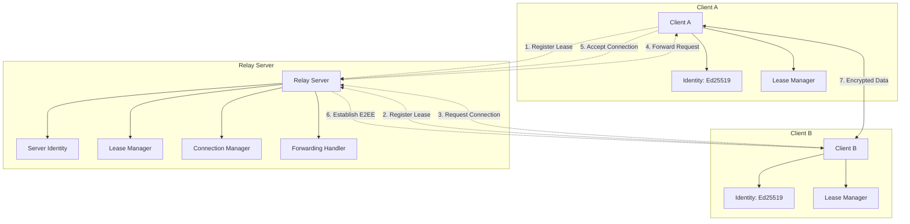
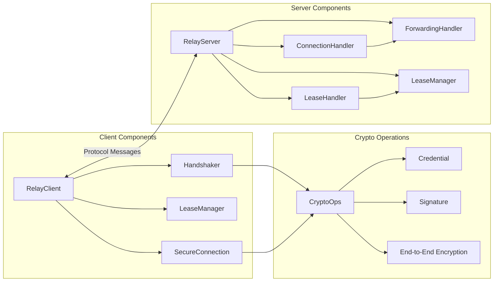
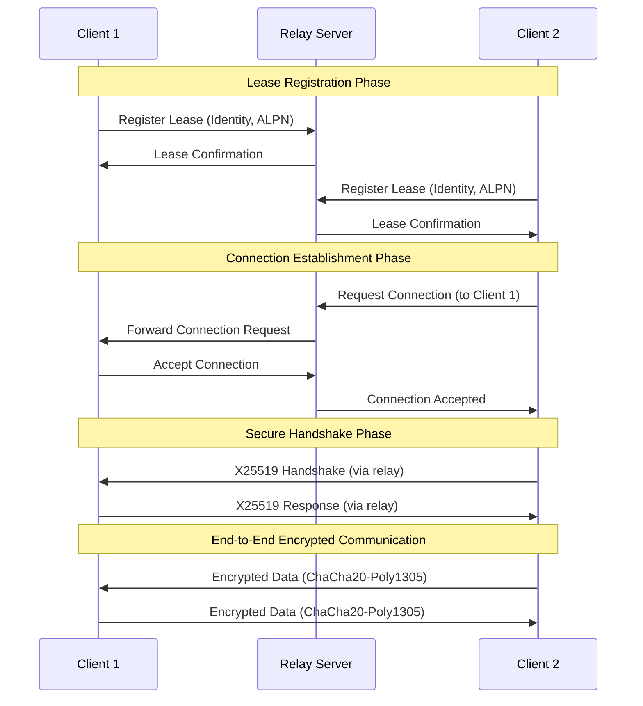

# PORTAL — Public Open Relay To Access Localhost

  

Portal is a secure, encrypted relay service that enables end-to-end encrypted communication between clients through a central relay server. It provides mutual authentication, forward secrecy, and secure connection management with cryptographic identity verification.

## Table of Contents

- [Overview](#overview)
- [Features](#features)
- [Architecture](#architecture)
- [Security](#security)
- [Installation](#installation)
- [Usage](#usage)
- [API Reference](#api-reference)
- [Protocol Specification](#protocol-specification)
- [Development](#development)
- [Contributing](#contributing)
- [License](#license)

## Overview

Portal implements a secure relay protocol that allows clients to register leases and establish encrypted connections through a central server. The system uses modern cryptographic primitives to ensure:

- **End-to-end encryption**: All communication is encrypted using ChaCha20-Poly1305 AEAD
- **Mutual authentication**: Ed25519 signatures verify client identities
- **Forward secrecy**: Ephemeral X25519 key exchange per connection
- **Secure relay**: The relay server cannot decrypt client communications

## Features

- 🔐 **End-to-End Encryption**: Client-to-client communication is fully encrypted
- 🔑 **Cryptographic Identity**: Ed25519-based identity system with verifiable signatures
- 🔄 **Connection Relay**: Secure connection forwarding through central server
- ⏰ **Lease Management**: Time-based lease system with automatic cleanup
- 🌐 **Protocol Support**: Application-Layer Protocol Negotiation (ALPN)
- 🚀 **High Performance**: Multiplexed connections using yamux
- 🐳 **Docker Support**: Containerized deployment ready
- 🌍 **Browser E2EE Proxy**: WASM-based Service Worker for automatic browser encryption
- 📱 **Multi-Platform**: Go SDK for servers, WASM SDK for browsers

## Architecture

### System Architecture

### Component Architecture

### Connection Flow

## Contributing

1. Fork the repository
2. Create a feature branch (`git checkout -b feature/amazing-feature`)
3. Commit your changes (`git commit -m 'Add amazing feature'`)
4. Push to the branch (`git push origin feature/amazing-feature`)
5. Open a Pull Request

## License

This project is licensed under the MIT License - see the [LICENSE](LICENSE) file for details.
