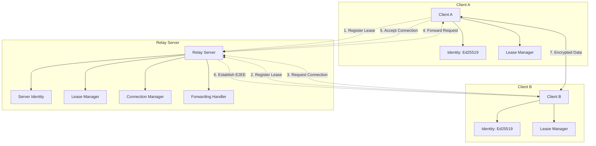
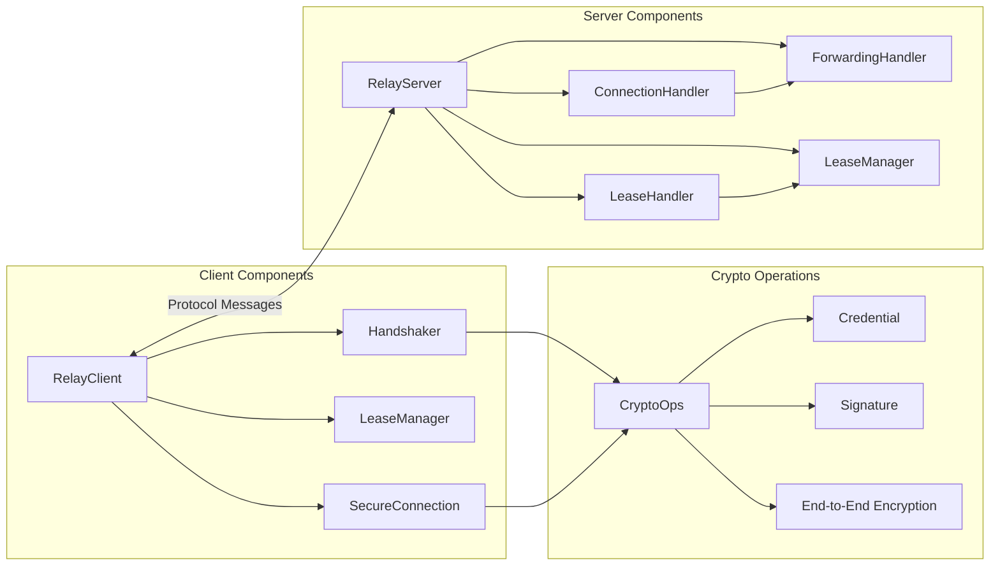
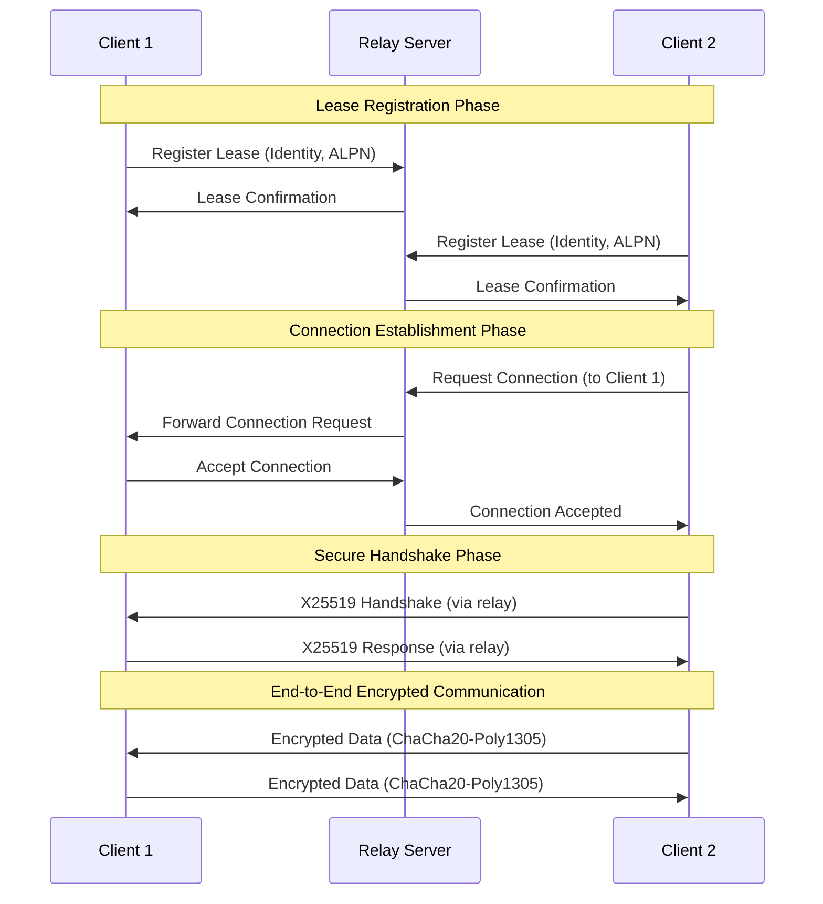

# Architecture

## System Architecture

```mermaid
graph TB
    subgraph "Client A"
        CA[Client A]
        CA --> CA_ID[Identity: Ed25519]
        CA --> CA_LEASE[Lease Manager]
    end

    subgraph "Client B"
        CB[Client B]
        CB --> CB_ID[Identity: Ed25519]
        CB --> CB_LEASE[Lease Manager]
    end

    subgraph "Relay Server"
        RS[Relay Server]
        RS --> RS_ID[Server Identity]
        RS --> LM[Lease Manager]
        RS --> CM[Connection Manager]
        RS --> FH[Forwarding Handler]
    end

    CA -.->|1. Register Lease| RS
    CB -.->|2. Register Lease| RS
    CB -.->|3. Request Connection| RS
    RS -.->|4. Forward Request| CA
    CA -.->|5. Accept Connection| RS
    RS -.->|6. Establish E2EE| CB

    CA <-->|7. Encrypted Data| CB
```

## Component Architecture

```mermaid
graph LR
    subgraph "Client Components"
        C[RelayClient]
        C --> H[Handshaker]
        C --> LM[LeaseManager]
        C --> SC[SecureConnection]
    end

    subgraph "Server Components"
        S[RelayServer]
        S --> LH[LeaseHandler]
        S --> CH[ConnectionHandler]
        S --> FH[ForwardingHandler]
        S --> LM2[LeaseManager]
    end

    subgraph "Crypto Operations"
        CO[CryptoOps]
        CO --> CRED[Credential]
        CO --> SIG[Signature]
        CO --> E2EE[End-to-End Encryption]
    end

    C <-->|Protocol Messages| S
    H --> CO
    SC --> CO
    LH --> LM2
    CH --> FH
```

## Connection Flow

```mermaid
sequenceDiagram
    participant C1 as Client 1
    participant RS as Relay Server
    participant C2 as Client 2

    Note over C1,C2: Lease Registration Phase
    C1->>RS: Register Lease (Identity, ALPN)
    RS->>C1: Lease Confirmation

    C2->>RS: Register Lease (Identity, ALPN)
    RS->>C2: Lease Confirmation

    Note over C1,C2: Connection Establishment Phase
    C2->>RS: Request Connection (to Client 1)
    RS->>C1: Forward Connection Request
    C1->>RS: Accept Connection
    RS->>C2: Connection Accepted

    Note over C1,C2: Secure Handshake Phase
    C2->>C1: X25519 Handshake (via relay)
    C1->>C2: X25519 Response (via relay)

    Note over C1,C2: End-to-End Encrypted Communication
    C2->>C1: Encrypted Data (ChaCha20-Poly1305)
    C1->>C2: Encrypted Data (ChaCha20-Poly1305)
```
