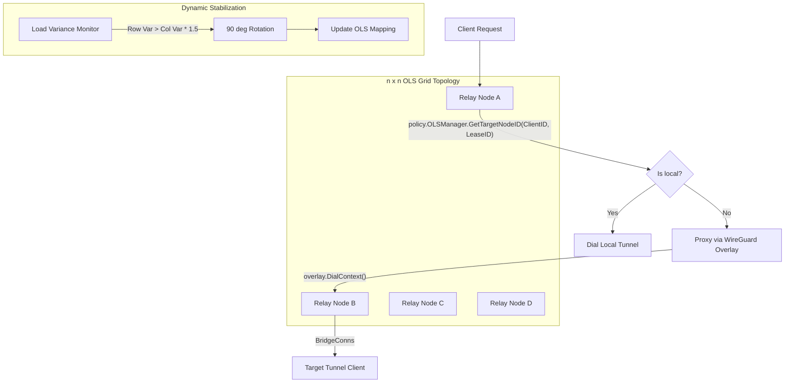

# OLS-based L7 Load Balancing Architecture

This document describes the design and implementation of the L7 load balancing system using Orthogonal Latin Squares (OLS) topology.

## 1. Design Principles

The portal nodes (RelayServers) form an $n \times n$ grid where $n = \lfloor\sqrt{N}\rfloor$ and $N$ is the total number of nodes. This grid provides a structured yet flexible way to distribute L7 traffic (HTTP/WebSocket) across a cluster of master nodes.

### Core Features:
- **Policy-Only OLS**: The `OLSManager` (in `portal/policy`) is strictly responsible for the load balancing algorithm. It does not handle networking or data transfer.
- **WireGuard Data Plane**: Actual data transfer between nodes is handled by the WireGuard overlay network.
- **Dynamic 90-degree Rotation**: If traffic becomes unbalanced (detected via load variance across rows vs. columns), the grid's routing logic rotates by 90 degrees to redistribute the load.

---

## 2. Mathematical Foundation: Recursive MOLS

The system generates two Mutually Orthogonal Latin Squares (MOLS) $L_1$ and $L_2$ for routing.

1.  **Decomposition**: Order $n$ is factorized into $m \times k$.
2.  **Base Case**: For prime orders, squares are generated using $L(i, j) = (s \cdot i + j) \pmod n$.
3.  **Composition (Kronecker Product)**:
    $$L(i, j) = A(\lfloor i/k \rfloor, \lfloor j/k \rfloor) \cdot k + B(i \pmod k, j \pmod k)$$
    This recursive approach allows constructing larger orthogonal squares without hardcoding tables.

---

## 3. Structure and Flow

### Routing Logic
For a given `ClientID` (source) and `LeaseID` (destination):
1.  Calculate grid coordinates $(i, j)$ using hashes.
2.  Lookup $L_1(i, j)$ and $L_2(i, j)$ to find the target cell in the $n \times n$ grid.
3.  Apply current linear transformation (rotation) to the coordinates.
4.  Route the request to the node ID mapped to those coordinates.

---

## 4. Master-to-Master Tunneling (WireGuard)

Each node maintains a WireGuard overlay network. When a request needs to be proxied:
- The source node looks up the target node's overlay address.
- Establishes a TCP connection via the WireGuard overlay (`overlay.DialContext`).
- Proxies the original connection to the target node.

This ensures that regardless of which master a client initially hits, the request can be forwarded to the optimal node defined by the OLS topology using a secure and high-performance data plane.
